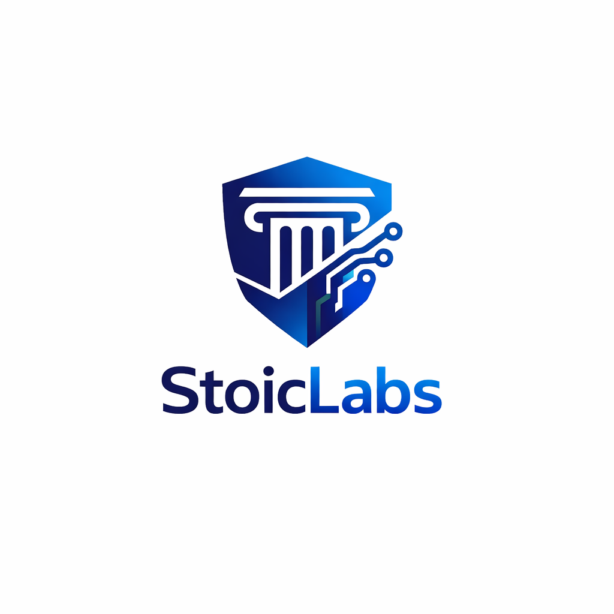

# 🚀 Stoiclabs Token (STOIC)

A custom token built on Solana using Token-2022 standard.

---

## 🔗 Token Information
- **Name:** Stoiclabs
- **Symbol:** STOIC
- **Network:** Devnet
- **Mint Address:** mntyTViAEeWwecRKSqoNpMZQo5jZBzaHGZWigtQsC2Y

---

## 📦 Metadata
- JSON stored on GitHub
- Image hosted via raw GitHub URL

---

## ⚙️ Features
- SPL Token (Token-2022)
- On-chain metadata support
- Off-chain metadata integration
- Custom token minting

---

## 🖼️ Logo

---

## 🧑‍💻 Author
**Nitin Upadhyaya**

---

## 🌐 Future Plans
- Phantom wallet integration
- Web UI for token interaction
- Deployment on Mainnet
